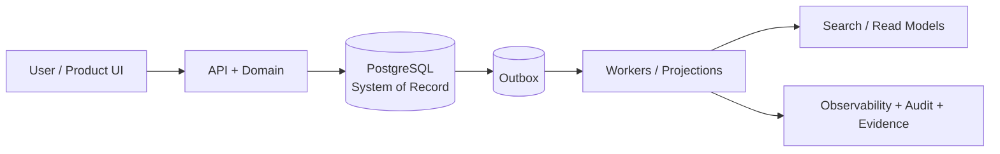
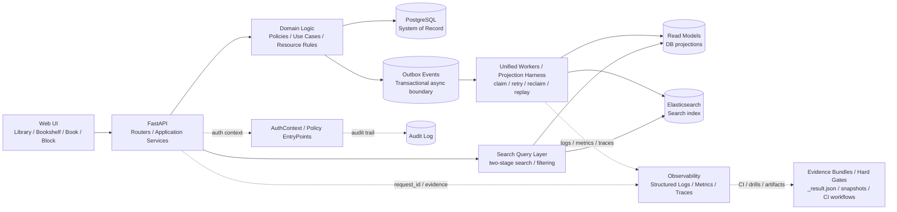

# Wordloom

_Wordloom_ is a data-heavy knowledge platform focused on backend architecture, schema evolution, outbox-driven workflows, search, and safe system evolution.

> **Type:** Data-heavy knowledge platform  
> **Focus:** Backend architecture, schema evolution, outbox-driven workflows, search, and safe system evolution  
> **Stack:** FastAPI, PostgreSQL, Elasticsearch, Next.js, Docker  
> **Engineering signals:** projections, observability, CI-gated drills, auditability

## Architecture at a glance

The graph below is intentionally simplified for GitHub readers seeing the project for the first time.



## Why this project exists

Wordloom exists to solve a practical product problem and a practical engineering problem at the same time.

- Product side: long-lived personal and team knowledge needs structure, search, history, and safe mutation.
- Engineering side: once the data model grows, simple CRUD stops being enough. Search, projections, async side effects, failure recovery, tenant isolation, and auditability all become first-class concerns.

This repository reflects that evolution directly: from schema decomposition and projection workers, to unified outbox handling, failure drills, hard gates, and security governance.

## What is inside

Core product surface:

- Library, Bookshelf, Book, and Block as the primary knowledge model.
- Tags, search, and recycle-bin style recovery flows.
- Next.js frontend, FastAPI backend, PostgreSQL as system-of-record.

Core engineering surface:

- Outbox-driven projections for async read models and side effects.
- Search indexing and two-stage query flows.
- Unified worker and daemon runtime with replay, retry, and failure handling.
- Observability through structured logs, metrics, traces, and evidence bundles.
- AuthContext, policy, and audit patterns for multi-tenant authorization.

## Demo and walkthrough

**Product surface**:


**Main content model: Library -> Bookshelf -> Book -> Block**.


**Engineering surface**:



**Engineering architecture: PostgreSQL is the system of record, outbox events define the async boundary, unified workers drive projections and search updates, and observability plus evidence bundles keep the runtime auditable and safe to evolve.**


## Architecture overview

At a high level, the system is organized around a few stable layers:

- API and application services handle request orchestration and input boundaries.
- Domain logic models product rules and resource behavior.
- PostgreSQL acts as the system-of-record.
- Outbox tables capture async work that must happen after a successful transaction.
- Workers and projection runtimes consume outbox events and build read models.
- Elasticsearch supports search-oriented read paths.
- Observability and evidence artifacts support debugging, drills, and safe rollout.

In practical terms, a common flow looks like this:

1. A request changes domain state inside PostgreSQL.
2. The same transaction appends an outbox record.
3. A worker or projection harness consumes that outbox event.
4. Read models, search indices, or downstream side effects are updated asynchronously.
5. Metrics, logs, traces, and artifacts provide machine-verifiable evidence for what happened.

## Engineering highlights

### 1. Schema modeling and evolution

The project contains explicit work on breaking apart overloaded tables, separating stable business facts from large or fast-changing payloads, and introducing clearer lifecycle boundaries.

### 2. Outbox and projection runtime

Wordloom uses an outbox pattern to separate transaction-time correctness from async side effects:

- The database transaction guarantees the business write and the outbox write together.
- Workers then process those events with retry, reclaim, replay, and failure classification.
- This makes the system honest about strong consistency inside the database and eventual consistency outside it.

### 3. Platformized projections and CI gates

Projection work in this repository is not just a collection of bespoke scripts. The codebase evolves toward a reusable projection platform with shared runtime behavior, reusable rebuild and backfill flows, drills and evidence contracts, and onboarding gates that determine whether a projection is platformized or still legacy.

### 4. Security and auditability

The repository also contains an explicit security-governance track:

- AuthContext carries request-level identity, tenant, role, and trace context.
- Policy entrypoints centralize authorization decisions.
- Audit records use stable action, result, and reason fields.
- Hard-gated drills verify tenant isolation, deny semantics, and traceable audit evidence.

## What makes this production-minded

This repository is not only about building features. A large part of the work is about making change safer.

- Failure drills exist for replay, retry, dual-run, and write-gate style rollout checks.
- Structured artifacts are treated as evidence, not as temporary debug leftovers.
- Backfill and rebuild paths are considered part of the system, not afterthought scripts.
- CI workflows are used to turn operational expectations into machine-verifiable gates.
- Observability is built into the runtime story rather than bolted on at the end.


## Quick start (Docker)

```powershell
# Prereq (Windows): install Docker Desktop and make sure it is running

# 0) Choose a working directory
cd <any path>

# 1) Clone
git clone https://github.com/samuelhu324-dev/Wordloom.git Wordloom

# 2) Enter repo
cd Wordloom

# 3) Copy docker env files
copy backend\.env.docker.example backend\.env.docker
copy frontend\.env.docker.example frontend\.env.docker

# 4) Start containers
docker compose up -d --build

# 5) Open (Frontend)
start http://localhost:31002
```

## Default ports

- Frontend: http://localhost:31002
- Backend API: http://localhost:31001
- Postgres: localhost:5434 (container 5432)

## Repository guide

If you are new to the repository, start here:

- backend/ for application, domain, infrastructure, workers, and projection code.
- frontend/ for the user-facing application.
- scripts/ and backend/scripts/ for operator tools, labs, migrations, and stable entrypoints.
- docs/logs/ for engineering evolution logs and decision trails.
- docs/UI&UX/ for lightweight frontend evidence notes and UI fix records.
- docs/runbook/ for operational procedures.
- docs/adr/ for architecture decisions when available.
- .github/workflows/ for CI drills and hard-gate automation.

## Current status

Wordloom should be read as an actively evolved engineering system, not a finished SaaS platform.

Current focus areas include:

- projection platformization,
- reliability and failure-management maturity,
- evidence-driven drills and CI gates,
- authorization and audit consistency.

Some areas are already strongly structured; others are still being migrated from legacy flows into reusable templates and hard-gated paths.

## Notes / troubleshooting

- Backend runs Alembic migrations via the container entrypoint.
- If `docker` is not found, Docker Desktop is not installed or not running.
- If `31002` is already in use, Docker Compose will fail with a port conflict; change the host port in `docker-compose.yml`.
- For deeper engineering workflows, prefer stable scripts, runbooks, and CI workflows over calling legacy scripts directly.
